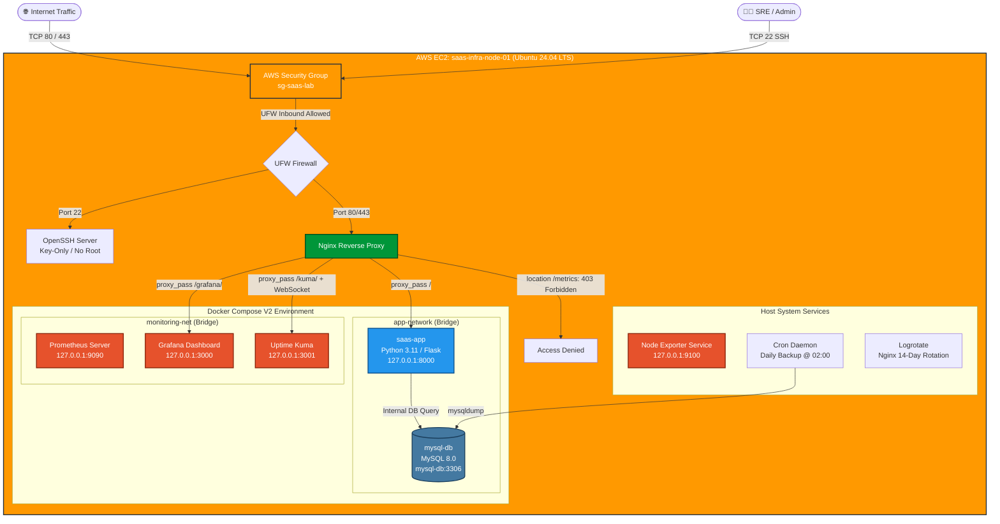
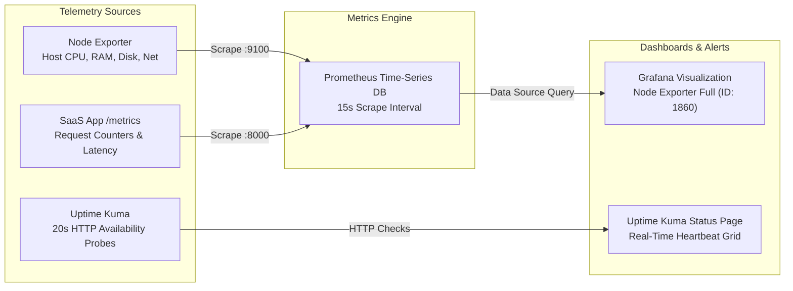

# 🚀 Linux SaaS Infrastructure Monitoring & Operations Lab

[](https://aws.amazon.com/ec2/)
[](https://docs.docker.com/compose/)
[](https://nginx.org/)
[](https://prometheus.io/)
[](https://grafana.com/)
[](https://github.com/louislam/uptime-kuma)
[](https://www.mysql.com/)
[](https://www.gnu.org/software/bash/)
[-green?style=for-the-badge&logo=linux&logoColor=white)](#security--hardening-summary)

> A production-grade Linux infrastructure and Site Reliability Engineering (SRE) lab deployed on **AWS EC2**. Features end-to-end Linux security hardening, containerized Python/Flask SaaS architecture with MySQL, host-level Nginx reverse proxying with metric endpoint protection, full-stack observability with Prometheus, Grafana, and Node Exporter, synthetic availability checks via Uptime Kuma, automated database backup & disaster recovery, centralized log rotation & inspection, 6 controlled chaos incident simulations with post-mortems, and an automated 10-point end-to-end validation suite.

---

> [!TIP]
> ### 📖 Complete Step-by-Step Implementation Guide
> Untuk panduan langkah-demi-langkah (Phase 1 s/d Phase 16) yang lengkap dengan seluruh konfigurasi, screenshot terminal/dashboard, dan catatan eksekusi command, silakan akses:
> 
> 👉 **[Lihat Dokumentasi Lengkap di Notion](https://bustling-bat-5ce.notion.site/Linux-SaaS-Infrastructure-Monitoring-Operations-Lab-3c6adecfe66d8097b6a4c35e3aef83e4?source=copy_link)**
---

## 📑 Table of Contents

- [Overview](#-overview)
- [System Architecture](#-system-architecture)
  - [High-Level Architecture](#high-level-architecture)
  - [Observability & Telemetry Flow](#observability--telemetry-flow)
  - [Network Isolation & Port Exposure Matrix](#network-isolation--port-exposure-matrix)
- [Infrastructure Specifications](#-infrastructure-specifications)
- [Key Engineering Highlights (16 Phases)](#-key-engineering-highlights-16-phases)
  - [1. Cloud Infrastructure & Security Hardening](#1-cloud-infrastructure--security-hardening)
  - [2. Containerized Microservices Stack](#2-containerized-microservices-stack)
  - [3. Host Nginx Reverse Proxy & Routing](#3-host-nginx-reverse-proxy--routing)
  - [4. Multi-Tier Observability & Monitoring](#4-multi-tier-observability--monitoring)
  - [5. Automated Backup & Disaster Recovery](#5-automated-backup--disaster-recovery)
  - [6. Centralized Logging & Network Flow Tracing](#6-centralized-logging--network-flow-tracing)
  - [7. Chaos Engineering & Controlled Incident Simulations](#7-chaos-engineering--controlled-incident-simulations)
  - [8. Incident Response Framework & Reports](#8-incident-response-framework--reports)
  - [9. SRE Operations Runbook & Daily Checklist](#9-sre-operations-runbook--daily-checklist)
  - [10. Automated End-to-End System Validation](#10-automated-end-to-end-system-validation)
- [Repository Structure](#-repository-structure)
- [Quick Start Guide](#-quick-start-guide)
- [Operations Runbook & Cheat Sheet](#-operations-runbook--cheat-sheet)
- [Security & Hardening Summary](#-security--hardening-summary)
- [Learning Outcomes & Core Competencies](#-learning-outcomes--core-competencies)

---

## 🔍 Overview

This lab demonstrates how to design, deploy, secure, monitor, and maintain a robust Linux SaaS server environment on **AWS EC2**. Rather than simply launching containers, this project emphasizes **operational readiness, security hardening, multi-tier observability, automated disaster recovery, and incident response**.

### Core Engineering Pillars

```text
+----------------------------------------------------------------------------------------------------+
|                                    LINUX SAAS INFRASTRUCTURE LAB                                   |
+-----------------------------------+----------------------------------+-----------------------------+
| 🛡️ Security & Hardening           | 📊 Full-Stack Observability      | 🔄 SRE & Operations         |
| • 2 GB Swap (OOM Prevention)      | • Node Exporter (Host Metrics)   | • Automated MySQL Backups   |
| • UFW Default-Deny Firewall       | • Prometheus (15s Scrapes)       | • 7-Day Backup Retention    |
| • SSH Key-Only Auth (No Root)     | • Grafana Operational Dashboards | • Tested Disaster Recovery  |
| • Protected /metrics (HTTP 403)   | • Uptime Kuma Synthetic Probes   | • Unified Logrotate Policy  |
| • Internal Network Isolation      | • App Custom Request Counters    | • 10-Point Automated E2E QA |
+-----------------------------------+----------------------------------+-----------------------------+
```

---

## 🏗️ System Architecture

### High-Level Architecture



### Observability & Telemetry Flow



### Network Isolation & Port Exposure Matrix

To enforce a strict **Zero-Trust & Defense-in-Depth** model, only required ports are exposed to the public Internet, while internal backend databases and observability endpoints are bound exclusively to `127.0.0.1` or internal Docker networks:

| Port | Protocol | Service | Binding / Network | AWS SG | UFW | Public Route | Purpose / Security Posture |
| :--- | :--- | :--- | :--- | :---: | :---: | :--- | :--- |
| **22** | TCP | OpenSSH | Host `0.0.0.0:22` | ✅ Allowed | ✅ Allowed | Direct SSH | Key-based authentication only, root login disabled |
| **80** | TCP | Nginx HTTP | Host `0.0.0.0:80` | ✅ Allowed | ✅ Allowed | `http://<IP>/` | Main public web ingress point |
| **443** | TCP | Nginx HTTPS | Host `0.0.0.0:443` | ✅ Allowed | ✅ Allowed | `https://<IP>/` | Encrypted SSL/TLS traffic ingress |
| **8000** | TCP | SaaS App | Localhost `127.0.0.1:8000` | ❌ Denied | ❌ Blocked | Via Nginx `/` | Python WSGI application container |
| **3306** | TCP | MySQL DB | Docker `app-network` only | ❌ Denied | ❌ Blocked | None (Internal) | Isolated relational database storage |
| **9100** | TCP | Node Exporter | Localhost `127.0.0.1:9100` | ❌ Denied | ❌ Blocked | None (Internal) | Host metrics collector systemd service |
| **9090** | TCP | Prometheus | Localhost `127.0.0.1:9090` | ❌ Denied | ❌ Blocked | None (Internal) | Time-series metrics collection engine |
| **3000** | TCP | Grafana | Localhost `127.0.0.1:3000` | ❌ Denied | ❌ Blocked | Via Nginx `/grafana/` | Operational metric dashboards (Auth protected) |
| **3001** | TCP | Uptime Kuma | Localhost `127.0.0.1:3001` | ❌ Denied | ❌ Blocked | Via Nginx `/kuma/` | Synthetic availability monitoring & WebSocket UI |
| **-** | HTTP | App `/metrics` | Internal `saas-app:8000` | - | - | 🚫 **HTTP 403** | Explicitly blocked at Nginx to prevent metric leakage |

---

## 💻 Infrastructure Specifications

| Parameter | Configuration | Engineering Rationale |
| :--- | :--- | :--- |
| **Cloud Provider** | Amazon Web Services (AWS) | Cloud infrastructure provisioning |
| **Compute Instance** | Amazon EC2 `t3.small` (2 vCPU, 2 GB RAM) | Supports multi-container Docker & monitoring stack |
| **Free-Tier Fallback** | `t2.micro` / `t3.micro` (1 GB RAM) | Validated with 2 GB Swap allocation |
| **Operating System** | Ubuntu Server 24.04 LTS (Noble Numbat) x86_64 | Modern LTS Linux kernel with systemd support |
| **Virtual Memory** | **2.0 GB Swap File** (`/swapfile`) | Mitigates Linux OOM (Out-of-Memory) Killer |
| **Storage (EBS)** | 20 GB gp3 General Purpose SSD | High IOPS baseline for MySQL & Prometheus TSDB |
| **Networking** | Elastic IP (EIP) associated | Static public IP address across reboots |
| **Firewall** | Dual Layer: AWS Security Group + Host UFW | Defense-in-depth perimeter & OS protection |

---

## ⚡ Key Engineering Highlights (16 Phases)

The lab implementation covers **16 structured operational phases** grouped into 6 core domains:

```text
  PHASE 01-03 ───► Cloud Infrastructure, Networking & Linux Security Hardening
  PHASE 04-06 ───► Docker Compose Microservices & Nginx Reverse Proxy Routing
  PHASE 07-09 ───► Full-Stack Telemetry (Node Exporter, Prometheus, Grafana, Uptime Kuma)
  PHASE 10-11 ───► Automated Backups, Tested Disaster Recovery & Centralized Logging
  PHASE 12-14 ───► Chaos Incident Simulations (INC-001 to INC-006) & Response Lifecycle
  PHASE 15-16 ───► SRE Troubleshooting Runbook & Automated 10-Point E2E Validation
```

### 1. Cloud Infrastructure & Security Hardening
* **AWS EC2 & Elastic IP**: Provisioned Ubuntu 24.04 LTS with a dedicated security group `sg-saas-lab` and Elastic IP association.
* **2 GB Swap Allocation**: Formatted and permanently mounted a 2 GB swapfile in `/etc/fstab` with `chmod 600` to prevent OOM process termination under combined Docker, DB, and monitoring workloads.
* **UFW Host Firewall**: Configured strict default-deny inbound rules with granular allowances for SSH (22), HTTP (80), and HTTPS (443).
* **SSH Hardening**: Enforced key-only authentication by creating `/etc/ssh/sshd_config.d/hardening.conf` with:
  ```ini
  PermitRootLogin no
  PasswordAuthentication no
  X11Forwarding no
  MaxAuthTries 3
  ```

### 2. Containerized Microservices Stack
* **Docker Engine & Docker Compose V2**: Configured the official Docker apt repository, keyring verification, and non-root `docker` user group privileges.
* **Python SaaS Application**: Containerized lightweight Flask application exposing home route `/` and Prometheus `/metrics` route via Gunicorn WSGI server.
* **Database Isolation**: Deployed MySQL 8.0 with persistent named volumes (`mysql_data`) and separated internal network (`app-network`). Credentials managed via `.env` file.

### 3. Host Nginx Reverse Proxy & Routing
* **Unified Gateway**: Configured host-level Nginx as the single entrypoint on port 80 routing to:
  * Application: `proxy_pass http://127.0.0.1:8000;`
  * Grafana Dashboard: `proxy_pass http://127.0.0.1:3000;` at `/grafana/`
  * Uptime Kuma: `proxy_pass http://127.0.0.1:3001;` at `/kuma/` with full WebSocket header support (`Upgrade $http_upgrade`, `Connection "upgrade"`).
* **Information Leakage Protection**: Implemented an explicit denial rule for the internal `/metrics` endpoint:
  ```nginx
  location /metrics {
      deny all;
      return 403;
  }
  ```

### 4. Multi-Tier Observability & Monitoring
* **Host Metrics**: Node Exporter v1.8.2 installed as a systemd service listening strictly on `127.0.0.1:9100`.
* **Metrics Ingestion**: Prometheus scraping Node Exporter and SaaS App metrics at a 15-second scrape interval.
* **Dashboards**: Grafana deployed with pre-configured subpath routing (`GF_SERVER_SERVE_FROM_SUB_PATH=true`), linked to Prometheus via internal Docker DNS (`http://prometheus:9090`), and provisioned with the official **Node Exporter Full Dashboard (ID: 1860)**.
* **Synthetic Availability**: Uptime Kuma monitoring the SaaS App HTTP endpoint with 20-second heartbeat probes.

### 5. Automated Backup & Disaster Recovery
* **Automated Backup Script** ([`backup-mysql.sh`](file:///d:/PROJECTS/linux-saas/linux-saas-infrastructure-lab/backup/backup-mysql.sh)): Executes `mysqldump` within the running container, compresses into `.tar.gz`, stores in `/opt/backups`, and enforces a **7-day retention policy**.
* **Disaster Recovery Script** ([`restore-mysql.sh`](file:///d:/PROJECTS/linux-saas/linux-saas-infrastructure-lab/backup/restore-mysql.sh)): Extracts the target archive into a temporary folder and restores the SQL dump directly into the container.
* **Scheduled Cron Execution**: Automated daily execution at 02:00 AM (`0 2 * * *`).
* **DR Drill Verification**: Successfully executed live disaster simulation by dropping database tables and verifying 100% data recovery from the latest archive.

### 6. Centralized Logging & Network Flow Tracing
* **Log Rotation**: Implemented `/etc/logrotate.d/nginx-saas` for daily Nginx log compression with 14-day retention.
* **Container Log Caps**: Enforced global Docker daemon log restrictions in `/etc/docker/daemon.json` (`max-size: 10m`, `max-file: 3`) to prevent uncontrolled disk exhaustion.
* **Interactive Log Viewer** ([`inspect-logs.sh`](file:///d:/PROJECTS/linux-saas/linux-saas-infrastructure-lab/docs/inspect-logs.sh)): Terminal utility to stream live Nginx access/error logs, container stdout/stderr, and UFW kernel drops.
* **Network Flow Tracing**: Validated Docker internal DNS resolution (`ping mysql-db`) and intra-container Prometheus scraping (`wget http://saas-app:8000/metrics`).

### 7. Chaos Engineering & Controlled Incident Simulations
To validate monitoring alerts and operational recovery, 6 realistic failure scenarios were simulated:

| Incident ID | Incident Name | Severity | Simulated Root Cause | Detection Indicator | Recovery Procedure |
| :--- | :--- | :---: | :--- | :--- | :--- |
| **INC-001** | Nginx Web Server Outage | **P1 (Critical)** | `systemctl stop nginx` | Uptime Kuma DOWN alert, `ERR_CONNECTION_REFUSED` | `systemctl start nginx` |
| **INC-002** | Application Container Crash | **P2 (High)** | `docker stop saas-app` | Nginx HTTP 502 Bad Gateway, Prometheus target DOWN | `docker start saas-app` |
| **INC-003** | MySQL Database Disruption | **P2 (High)** | `docker stop mysql-db` | Application DB connection timeout / refused | `docker start mysql-db` / DR Restore |
| **INC-004** | Sustained High CPU Load | **P3 (Medium)** | `stress-ng --cpu 2 --timeout 60s` | Grafana CPU spike to ~100%, high load metric | `killall stress-ng` |
| **INC-005** | Disk Storage Depletion | **P1 (Critical)** | `fallocate -l 5G /tmp/dummy.img` | Grafana disk available metric < 5% | `rm /tmp/dummy.img`, logrotate |
| **INC-006** | Nginx Misconfiguration | **P2 (High)** | Invalid upstream port in Nginx config | Nginx HTTP 502 Bad Gateway, error log upstream refused | Fix upstream port, `nginx -t`, reload |

### 8. Incident Response Framework & Reports
All incidents are processed through the standard **5-Stage Incident Lifecycle**:
```text
  [ 1. DETECTION ] ──► [ 2. CONTAINMENT ] ──► [ 3. RCA & INVESTIGATION ] ──► [ 4. REMEDIATION ] ──► [ 5. POST-MORTEM ]
```
Detailed incident post-mortem reports are documented in the [`incidents/`](file:///d:/PROJECTS/linux-saas/linux-saas-infrastructure-lab/incidents) directory:
* [`INC-001-nginx-down.md`](file:///d:/PROJECTS/linux-saas/linux-saas-infrastructure-lab/incidents/INC-001-nginx-down.md)
* [`INC-002-application-down.md`](file:///d:/PROJECTS/linux-saas/linux-saas-infrastructure-lab/incidents/INC-002-application-down.md)
* [`INC-003-database-failure.md`](file:///d:/PROJECTS/linux-saas/linux-saas-infrastructure-lab/incidents/INC-003-database-failure.md)
* [`INC-004-high-cpu.md`](file:///d:/PROJECTS/linux-saas/linux-saas-infrastructure-lab/incidents/INC-004-high-cpu.md)
* [`INC-005-disk-full.md`](file:///d:/PROJECTS/linux-saas/linux-saas-infrastructure-lab/incidents/INC-005-disk-full.md)
* [`INC-006-nginx-proxy.md`](file:///d:/PROJECTS/linux-saas/linux-saas-infrastructure-lab/incidents/INC-006-nginx-proxy.md)

### 9. SRE Operations Runbook & Daily Checklist
Documented daily health checks, triage commands, and emergency disaster recovery workflows in [`docs/troubleshooting-guide.md`](file:///d:/PROJECTS/linux-saas/linux-saas-infrastructure-lab/docs/troubleshooting-guide.md).

### 10. Automated End-to-End System Validation
Developed [`docs/e2e-validation.sh`](file:///d:/PROJECTS/linux-saas/linux-saas-infrastructure-lab/docs/e2e-validation.sh) to execute a comprehensive 10-point automated health inspection across OS, security, containers, reverse proxy, metrics, and backups.

---

## 🧪 Automated End-to-End System Validation

The script [`docs/e2e-validation.sh`](file:///d:/PROJECTS/linux-saas/linux-saas-infrastructure-lab/docs/e2e-validation.sh) executes automated verification checks:

```bash
chmod +x ~/linux-saas-infrastructure-lab/docs/e2e-validation.sh
~/linux-saas-infrastructure-lab/docs/e2e-validation.sh
```

### 10-Point Validation Checklist

| # | Validation Item | Command / Condition Checked | Expected Result | Status |
| :-: | :--- | :--- | :--- | :---: |
| **1** | **Swap Space** | `free -m \| awk '/Swap:/ {print $2}'` | Total Swap > 1000 MB | `PASS` |
| **2** | **UFW Firewall** | `ufw status \| grep "Status: active"` | Firewall active & enforcing rules | `PASS` |
| **3** | **SSH Hardening** | `grep "PermitRootLogin no" /etc/ssh/sshd_config.d/hardening.conf` | Root login & passwords disabled | `PASS` |
| **4** | **Docker Daemon** | `docker info` | Docker Engine running & operational | `PASS` |
| **5** | **Running Containers** | `docker ps -q \| wc -l` | At least 4+ containers running | `PASS` |
| **6** | **Nginx Reverse Proxy** | `curl -s -I http://127.0.0.1` | HTTP 200 OK response from SaaS app | `PASS` |
| **7** | **Metrics Endpoint Protection** | `curl -s -o /dev/null -w "%{http_code}" http://127.0.0.1/metrics` | **HTTP 403 Forbidden** (Protected) | `PASS` |
| **8** | **Node Exporter Health** | `curl -s http://127.0.0.1:9100/metrics \| grep node_cpu` | Metrics stream active on port 9100 | `PASS` |
| **9** | **Prometheus Targets** | `curl -s http://127.0.0.1:9090/api/v1/targets \| grep health` | All targets in `"health": "up"` state | `PASS` |
| **10** | **Backup Directory** | `[ -d /opt/backups ] && [ -f /opt/backups/*.tar.gz ]` | Backup directory exists with valid archives | `PASS` |

```text
==================================================
    STARTING END-TO-END SYSTEM VALIDATION TEST    
==================================================
[ PASS ] Swap Space configured (>= 1GB)
[ PASS ] UFW Firewall Active
[ PASS ] SSH Hardening Configured
[ PASS ] Docker Daemon Operational
[ PASS ] All Docker Containers Running (>= 4)
[ PASS ] Nginx Reverse Proxy responding (HTTP 200)
[ PASS ] Endpoint /metrics Protected (HTTP 403)
[ PASS ] Node Exporter active on port 9100
[ PASS ] Prometheus Targets Healthy
[ PASS ] Backup Directory & Retention Operational
==================================================
ALL END-TO-END VALIDATION TESTS PASSED SUCCESSFULLY!
==================================================
```

---

## 📁 Repository Structure

```text
linux-saas-infrastructure-lab/
├── README.md                              # Main Project Documentation & Architecture Overview
├── .gitignore                             # Git ignore rules (credentials, logs, dumps)
│
├── docker/                                # Docker Container Orchestration
│   ├── docker-compose.yml                 # Multi-container stack (App, MySQL, Prometheus, Grafana, Kuma)
│   ├── .env.example                       # Template for environment variables and secrets
│   ├── monitoring/
│   │   └── prometheus/
│   │       └── prometheus.yml             # Prometheus scraping targets & interval configuration
│   └── nginx/
│       ├── saas-app.conf                  # Nginx Virtual Host reverse proxy configuration
│       └── default                        # Backup default configuration
│
├── backup/                                # Database Backup & Disaster Recovery
│   ├── backup-mysql.sh                    # Automated mysqldump backup script with 7-day retention
│   └── restore-mysql.sh                   # Disaster recovery restoration script
│
├── docs/                                  # Operations, SRE & QA Tooling
│   ├── e2e-validation.sh                  # 10-Point automated infrastructure verification suite
│   ├── inspect-logs.sh                    # Interactive live log streaming & inspection CLI tool
│   └── troubleshooting-guide.md           # SRE Operations Runbook & Daily Checklist
│
└── incidents/                             # SRE Chaos Engineering Post-Mortem Incident Reports
    ├── INC-001-nginx-down.md              # Incident Report: Nginx Web Server Outage
    ├── INC-002-application-down.md        # Incident Report: SaaS Application Container Failure
    ├── INC-003-database-failure.md        # Incident Report: MySQL Database Service Interruption
    ├── INC-004-high-cpu.md                # Incident Report: High CPU Utilization Stress
    ├── INC-005-disk-full.md               # Incident Report: Disk Space Depletion Simulation
    └── INC-006-nginx-proxy.md             # Incident Report: Nginx Upstream Misconfiguration
```

---

## 🚀 Quick Start Guide

### Prerequisites
* AWS EC2 instance running Ubuntu 24.04 LTS with Elastic IP.
* Ports 22, 80, and 443 open in AWS Security Group.
* OpenSSH client installed locally.

### 1. Clone the Repository
```bash
git clone https://github.com/your-username/linux-saas-infrastructure-lab.git ~/linux-saas-infrastructure-lab
cd ~/linux-saas-infrastructure-lab
```

### 2. Configure Environment Variables
```bash
cd ~/linux-saas-infrastructure-lab/docker
cp .env.example .env
# Edit .env with your custom secure passwords:
nano .env
```

### 3. Deploy the Container Stack
```bash
docker compose up -d
docker compose ps
```

### 4. Deploy Nginx Configuration & Restart Services
```bash
sudo cp ~/linux-saas-infrastructure-lab/docker/nginx/saas-app.conf /etc/nginx/sites-available/saas-app.conf
sudo ln -sf /etc/nginx/sites-available/saas-app.conf /etc/nginx/sites-enabled/
sudo rm -f /etc/nginx/sites-enabled/default
sudo nginx -t && sudo systemctl reload nginx
```

### 5. Run Automated End-to-End Validation
```bash
chmod +x ~/linux-saas-infrastructure-lab/docs/e2e-validation.sh
~/linux-saas-infrastructure-lab/docs/e2e-validation.sh
```

---

## 🛠️ Operations Runbook & Cheat Sheet

### Service Management
```bash
# Check Docker Stack Status
docker compose -f ~/linux-saas-infrastructure-lab/docker/docker-compose.yml ps

# Restart specific services
docker compose -f ~/linux-saas-infrastructure-lab/docker/docker-compose.yml restart saas-app
docker compose -f ~/linux-saas-infrastructure-lab/docker/docker-compose.yml restart mysql-db

# Check and reload Nginx
sudo nginx -t && sudo systemctl reload nginx
sudo systemctl status nginx --no-pager
```

### Resource & Security Inspection
```bash
# Check Memory & Swap
free -h

# Check Disk Usage
df -h /

# Check CPU & Top Processes
top -b -n 1 | head -n 15

# Check Firewall Rules
sudo ufw status verbose
```

### Backup & Disaster Recovery Execution
```bash
# Trigger manual backup
~/linux-saas-infrastructure-lab/backup/backup-mysql.sh

# List available backup archives
ls -lh /opt/backups/

# Restore database from latest backup
LATEST=$(ls -t /opt/backups/*.tar.gz | head -n 1)
~/linux-saas-infrastructure-lab/backup/restore-mysql.sh "$LATEST"
```

### Interactive Centralized Log Streaming
```bash
~/linux-saas-infrastructure-lab/docs/inspect-logs.sh
```

---

## 🔒 Security & Hardening Summary

1. **Defense-in-Depth Firewalling**: Network security enforced at both AWS cloud perimeter (Security Group) and operating system level (UFW).
2. **Zero Ingress on Internal Services**: Databases and monitoring backends are strictly inaccessible from public networks.
3. **Information Disclosure Prevention**: Nginx denies public HTTP access to `/metrics` (HTTP 403), ensuring internal metrics are only ingested by the internal Prometheus container.
4. **SSH Attack Surface Reduction**: Root login disabled, password authentication disabled, maximum auth attempts capped at 3.
5. **Memory & Storage Safety**: 2 GB swap file protects against OOM kernel panics; Docker log caps and logrotate protect against storage exhaustion.
6. **Least Privilege**: Application containers run in isolated Docker bridge networks without host network privileges.

---

## 🎓 Learning Outcomes & Core Competencies

This project demonstrates practical competency in:

* **Cloud & Linux Infrastructure**: AWS EC2 provisioning, Elastic IP management, Ubuntu 24.04 LTS administration, systemd service management, swap space configuration, and storage management.
* **Network & Security Engineering**: Cloud Security Groups, UFW firewall configuration, OpenSSH server hardening, reverse proxy design, and network isolation.
* **Container Orchestration**: Docker Engine, Docker Compose V2 multi-container orchestration, persistent volume lifecycle, and bridge networking.
* **Observability & Site Reliability Engineering (SRE)**: Prometheus time-series scraping, Node Exporter host telemetry, Grafana dashboards, and Uptime Kuma synthetic availability checks.
* **Automation & Disaster Recovery**: Bash scripting, automated database backups via `mysqldump`, cron scheduling, retention lifecycle management, and verified DR restoration.
* **Incident Response & Chaos Engineering**: Controlled failure injection, root cause analysis (RCA), emergency runbooks, structured post-mortem reports, and automated QA verification.

---

## 📄 License & Attribution

This project is open-source and available under the **MIT License**. Created as part of the **Linux SaaS Infrastructure Monitoring & Operations Lab**.

> For the detailed, step-by-step implementation guide with all command logs and configuration screenshots, visit the **[Notion Implementation Guide](https://bustling-bat-5ce.notion.site/Linux-SaaS-Infrastructure-Monitoring-Operations-Lab-3c6adecfe66d8097b6a4c35e3aef83e4?source=copy_link)**.
